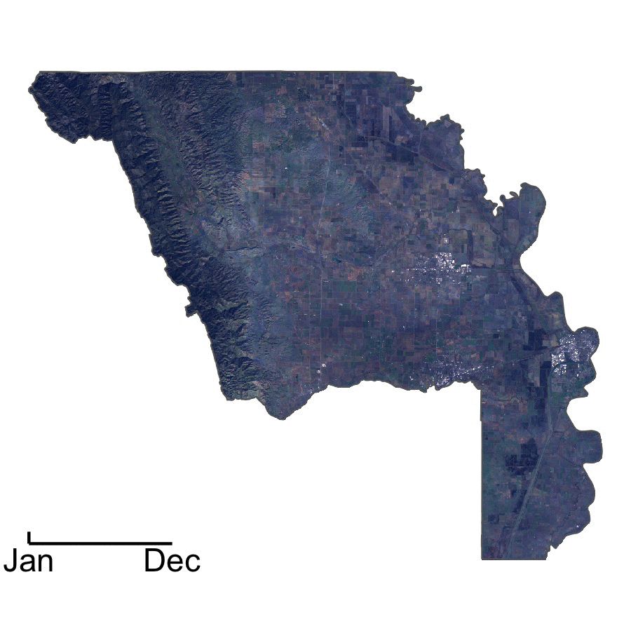

# Generate high-definition contextual maps

This repository contains code for accessing, filtering, and downloading satellite-derived imagery (using Google Earth Engine), and plotting that imagery for contextual maps (using R and the power of ggplot) to be used in publications and presentations. 

Imagery can be accessed, trimmed to a Region of Interest (ROI), cleaned of poor-quality data and downloaded via Earth Engine using the contents of the `scripts/getData.txt` script in your Earth Engine code editor. For your convenience, the data that are generated through that script are available in the `data/` folder.

Once you've got your data, you can use the `scripts/plotMaps.R` script to generate minimalist maps that provide context to your audience. Below are two examples: the first is an image of Yolo County, California (the `scripts/` folder includes materials to reproduce exactly this image); the second is an image of California with the Sierra Nevada ecoregion highlighted in light grey (challenge: can you reproduce this image on your own?).

### Challenge

If you're feeling ambitious, try generating monthly median aggregates in Earth Engine using the code in `scripts/getData_monthlyMed.txt`. You can then use `scripts/plotMonths.R` to iterate the plotting workflow from above across a folder of images. Again, for your convenience, some example data have already been downloaded and can be found in the `data/monthly/` subdirectory. Finally, use `scripts/jpg2gif.py` to combine your 12 monthly aggregates into a gif!

`$ python3 ./scripts/jpg2gif.py ./plots/monthly/`

